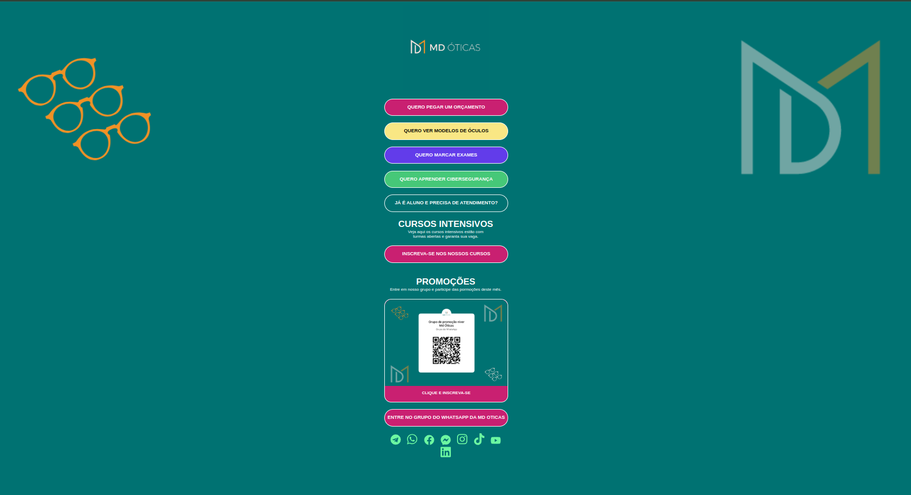

Perfeito, Marcos! Agora que o projeto evoluiu para a **Bio da MD Óticas**, vou te ajudar a atualizar o `README.md` com:

- Título e descrição coerentes com o novo objetivo  
- Link atualizado do GitHub Pages  
- Prints atualizados (incluindo a imagem que você enviou)  
- O que foi aprendido e tecnologias usadas  
- Estilo visual mais organizado e profissional

---

### ✅ Novo `README.md` adaptado para o projeto **bio.mdoticas**

```markdown
# 🌐 Bio da MD Óticas

Este projeto tem como objetivo criar uma página de **bio interativa** para a MD Óticas, reunindo todos os principais links e ações disponíveis para clientes e alunos. A página foi desenvolvida com foco em **design responsivo, usabilidade e identidade visual personalizada** para a marca.

## 🔎 Funcionalidades

- Acesso direto a orçamentos, catálogos de óculos e agendamentos
- Área de cursos e cibersegurança
- Promoções mensais com QR Code e grupo de WhatsApp
- Botões para redes sociais: WhatsApp, Instagram, Facebook, TikTok, LinkedIn e YouTube
- Totalmente responsivo

## 🚀 Link da Página

🔗 [https://marcosaureliosl.github.io/bio.mdoticas/](https://marcosaureliosl.github.io/bio.mdoticas/)

## 📸 Imagem do Projeto

 

## 💡 O que foi aprendido

Durante o desenvolvimento deste projeto, foi possível reforçar conhecimentos importantes como:

- Criação de layouts centrados no usuário
- Estilização com CSS focando em identidade visual
- Reset global e estrutura limpa de HTML/CSS
- Uso de cores acessíveis e animações suaves
- Deploy com GitHub Pages

## 🧪 Tecnologias Utilizadas

- HTML5
- CSS3
- Git + GitHub
- GitHub Pages

## 📁 Estrutura do Projeto

```
bio.mdoticas/
│
├── index.html
├── README.md
└── assets/
    └── img/
        └── md-bio-preview.png
```

## 🙏 Agradecimentos

Agradeço a todos que me acompanharam nesse processo de evolução. Este projeto é mais um passo na jornada de aprendizado e construção de portfólio. Obrigado pelo apoio! 💙
```

